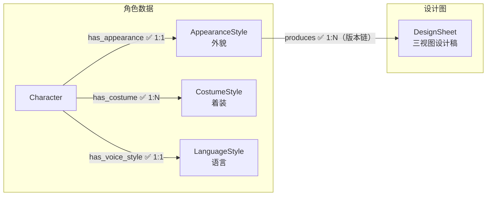
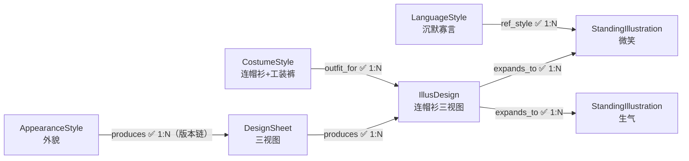

# 02 角色美术

---

## 节点

### 语言风格（LanguageStyle）

每个角色一个。定义角色的说话方式、语气、口头禅等。立绘的表情和动作参考语言风格生成。

| 字段 | 中文 | 类型 | 必填 | 说明 |
|------|------|------|------|------|
| id | 编号 | string | 是 | snowflake Base62 |
| name | 名称 | string | 是 | `[角色名]语言风格` |
| vocabulary | 词汇风格 | string | 否 | 正式/随意、技术性/口语化、阵营术语偏好 |
| rhythm | 句子节奏 | string | 否 | 短促急迫 / 长句思考型 / 混合 |
| habits | 语言习惯 | string | 否 | 口头禅、犹豫模式、特定短语 |
| emotion_patterns | 情绪模式 | string | 否 | 5 种情境（平静/紧张/愤怒/悲伤/轻松）的表达变化 |
| description | 概要 | string | 否 | 简短总结（1-2 句，含身份/绝不会说的话/标准台词等压缩信息） |
| status | 流程状态 | int | 否 | `0` |

**status 枚举**：`0` 待设计 → `1` 已完成

---

### 外貌特征（AppearanceStyle）

每个角色一个。定义角色的固定外貌（脸、体型、发色、瞳色等）。纯数据节点，不参与风格继承。

| 字段 | 中文 | 类型 | 必填 | 说明 |
|------|------|------|------|------|
| id | 编号 | string | 是 | snowflake Base62 |
| name | 名称 | string | 是 | `[角色名]外貌特征` |
| appearance | 外貌描述 | string | 否 | 自由文本：综合气质、身高、整体观感（`约168cm, 曼妙匀称, 慵懒妩媚`） |
| visual_tone | 视觉气质 | string | 否 | 自由文本：氛围/气质一句话 |
| first_impression | 第一印象 | string | 否 | 自由文本 |
| shape_language | 形状语言 | string | 否 | 标签：三角型/方型/倒三角/细长型/圆形/不对称 |
| age_impression | 年龄感 | string | 否 | 标签 |
| body_type | 体态 | string | 否 | 标签 |
| skin_tone | 肤色 | string | 否 | 标签 |
| ethnicity | 面孔/人种 | string | 否 | 标签：中国面孔/日系面孔/韩系面孔/东南亚面孔/欧美面孔/中东面孔/非裔面孔/混血面孔 |
| hair | 头发 | string | 否 | 合成组合（发色+发型+发长）：`深棕色大波浪长发` |
| eye | 眼睛 | string | 否 | 合成组合（瞳色+眼型）：`琥珀色上挑眼` |
| lip_shape | 唇形 | string | 否 | 标签 |
| marks | 特殊标记 | string | 否 | 标签（可多选） |
| height_cm | 身高cm | int | 否 | 数值身高，供立绘显示缩放推算（迁移自 appearance 文本；今后由 char-concept-designer 填写） |
| status | 流程状态 | int | 否 | `0` |

**status 枚举**：`0` 待设计 → `1` 已完成

---

### 着装特征（CostumeStyle）

每套装扮一个节点。定义角色的具体着装（衣物、配饰、材质等）。由 `char-costume-designer` skill 创建，创建后即 `status=1`（已完成，无审批）。

| 字段 | 中文 | 类型 | 必填 | 说明 |
|------|------|------|------|------|
| id | 编号 | string | 是 | snowflake Base62 |
| name | 名称 | string | 是 | `着装名称`：简短描述，例如工作服 |
| outfit_style | 着装风格 | string | 否 | 标签（可多选）：休闲/正式/性感/古风... |
| garment | 服装 | string | 否 | 合成组合（材质+服装类型）：`棉衬衫`（多件分号：`棉衬衫;黑色丝袜`） |
| footwear | 鞋类 | string | 否 | 标签 |
| accessory_type | 配饰类型 | string | 否 | 标签（可多选） |
| status | 流程状态 | int | 否 | `0` |

**status 枚举**：`0` 待设计 → `1` 已完成

> 无审批流程：着装内容由 `char-costume-designer` 生成后即 `status=1` 已完成，直接参与下游 IllusDesign 生产。

---

### 设计图（DesignSheet）

每角色每版本一个。首版/常规重做为**参考图图生图**——以用户提供的单张真人参考照片为底，`AppearanceStyle` 外貌属性全量作补充特征（冲突以属性为准）；参考图为**文件系统约定**（`06_角色美术/<char_name>/参考图.jpg`，兼容 .png/.jpeg——经 dashboard 上传自动压缩与规范命名，或手动放置；不入库、无 Schema 字段），缺失时 char-design-sheet 停止并提示（用户动作阻塞，不回退文生图）。剧情永久外貌变更（剪发/毁容等）时**以参考版设计图为底图生图新增版本**（仅变更 `delta_notes` 口述内容，保持同人物脸部一致），不改写旧版——旧链下游零作废。

| 字段 | 中文 | 类型 | 必填 | 说明 |
|------|------|------|------|------|
| id | 编号 | string | 是 | snowflake Base62 |
| delta_notes | 改动说明 | string | 否 | **增量版本专用**：本版本相对参考版的口述变更描述（如「理发店剪发后：清爽利落的黑色短发，发丝干净有型」），图生图 prompt 变更段的唯一来源；首版留空 |
| active_from | 生效锚点 | int | 否 | `chapter_no*1000+section_no`（ch01/sec02=1002）；空 = 首版（最早恒生效）。消费方取「≤当前叙事位置的最新版本」（如 section-voice-publisher 选绘分流） |
| slug | 版本短名 | string | 否 | 多版本时增量版必填——产物路径目录段（如 短发）：`06_角色美术/<char_name>/<slug>/`；空 = 首版/单版角色保持旧路径零迁移；禁 Windows 非法字符 |
| prompt_path | 提示词文件 | string | 否 | 派生 prompt 文件相对路径（首版 `06_角色美术/<char_name>/prompt.md`；slug 非空 `06_角色美术/<char_name>/<slug>/prompt.md`），由 assembler 从上游 tags + 美术风格.md 生成 |
| image_path | 图片路径 | string | 否 | `06_角色美术/<char_name>/设计图.png`（slug 非空 `06_角色美术/<char_name>/<slug>/设计图.png`） |
| status | 流程状态 | int | 否 | `0` |

**status 枚举**：`0` 待生成 → `1` 提示词文件已生成 → `2` 图片生成完成 → `10` 待审 → `11` 批准

> **修正 active_from/slug/delta_notes 用 cypher 直改，勿走 dashboard 编辑器**——编辑 DesignSheet 属性会沿 sync 边级联作废该版本全部 IllusDesign 与立绘。

---

### 立绘设计图（IllusDesign）

每个 (DesignSheet, CostumeStyle) 组合一个——同角色同着装可因多版本设计图（如剪发前后）并存多版本。角色穿着特定着装的三视图设计稿——由设计图（外貌基础）和着装特征共同决定。

| 字段 | 中文 | 类型 | 必填 | 说明 |
|------|------|------|------|------|
| id | 编号 | string | 是 | snowflake Base62 |
| prompt_path | 提示词文件 | string | 否 | 派生 prompt 文件相对路径 |
| image_path | 图片路径 | string | 否 | `./06_角色美术/<char_name>/<CostumeStyle.name>/立绘设计图.png`（所属设计图 slug 非空时 `./06_角色美术/<char_name>/<slug>/<CostumeStyle.name>/立绘设计图.png`） |
| adaptation_notes | 着装补充说明 | string | 否 | `左臂夹持文件夹` |
| display_scale | 显示缩放 | float | 否 | 运行时立绘显示缩放（1.0=占满立绘层满高）；留空则由 init 脚本按上游 height_cm/REF_HEIGHT 推算 |
| status | 流程状态 | int | 否 | `0` |

**status 枚举**：`0` 待生成 → `1` 提示词文件已生成 → `2` 图片生成完成 → `10` 待审 → `11` 批准

---

### 立绘（StandingIllustration）

从立绘设计图拓展出的具体变体——不同表情、动作的单张立绘。每张独立节点。表情和动作参考角色的 LanguageStyle 生成。

| 字段 | 中文 | 类型 | 必填 | 说明 |
|------|------|------|------|------|
| id | 编号 | string | 是 | snowflake Base62 |
| prompt_path | 提示词文件 | string | 否 | 派生 prompt 文件相对路径（`06_角色美术/<char_name>/<CostumeStyle.name>/立绘/<variant_label>.md`；所属设计图 slug 非空时插 `<slug>/` 段：`06_角色美术/<char_name>/<slug>/<CostumeStyle.name>/立绘/<variant_label>.md`） |
| image_path | 图片路径 | string | 否 | `./06_角色美术/<char_name>/<CostumeStyle.name>/立绘/<variant_label>.png`（同上 slug 规则） |
| variant_label | 变体 | string | 是 | 简短自由词（2~4 字，如 慵懒/玩味/挑眉/茫然/沉吟/庄严/浅笑），不设词表限制 |
| description | 变体氛围 | string | 否 | 该变体所服务台词的氛围/情绪情境说明（如「宿醉初醒被调戏，赔笑周旋，眼神闪躲带讨好」），由 section-voice-publisher 选绘判断兜底建变体时创作，供出图 skill 把握表情强度、身体朝向与动作张力 |
| eye | 眼部 | string | 否 | 标签 |
| brow | 眉毛 | string | 否 | 标签 |
| mouth | 嘴部 | string | 否 | 标签 |
| head_angle | 头部角度 | string | 否 | 标签 |
| hand | 手部动作 | string | 否 | 标签 |
| foot | 脚部动作 | string | 否 | 标签 |
| status | 流程状态 | int | 否 | `0` |

**status 枚举**：`0` 待生成 → `1` 提示词文件已生成 → `2` 图片生成完成 → `10` 待审 → `11` 批准

---

## 边

### 角色数据关联

#### has_appearance — 角色拥有外貌特征 `1:1`

- **方向**：`Character → AppearanceStyle`

| 属性 | 中文 | 类型 | 必填 | 说明 |
|------|------|------|------|------|
| sync | 同步 | boolean | 否 | 默认 `true` |

---

#### has_costume — 角色拥有着装特征 `1:N`

- **方向**：`Character → CostumeStyle`

| 属性 | 中文 | 类型 | 必填 | 说明 |
|------|------|------|------|------|
| sync | 同步 | boolean | 否 | 默认 `true` |

---

#### has_voice_style — 角色拥有语言风格 `1:1`

- **方向**：`Character → LanguageStyle`

| 属性 | 中文 | 类型 | 必填 | 说明 |
|------|------|------|------|------|
| sync | 同步 | boolean | 否 | 默认 `true` |

---

### 美术生产链

#### produces — 外貌产出设计图 `1:N`

- **方向**：`AppearanceStyle → DesignSheet`
- **说明**：设计图由外貌特征产出（角色不再直接指向设计图）。剧情永久外貌变更（如剪发）时以参考版设计图为底**图生图新增版本**（DesignSheet 带 delta_notes/active_from/slug），不改写旧版——旧链下游零作废

| 属性 | 中文 | 类型 | 必填 | 说明 |
|------|------|------|------|------|
| sync | 同步 | boolean | 否 | 默认 `true` |

---

#### produces — 设计图产出立绘设计图 `1:N`

- **方向**：`DesignSheet → IllusDesign`

| 属性 | 中文 | 类型 | 必填 | 说明 |
|------|------|------|------|------|
| sync | 同步 | boolean | 否 | 默认 `true`（设计图更新级联重置立绘设计图） |

---

#### outfit_for — 着装提供方案 `1:N`

- **方向**：`CostumeStyle → IllusDesign`
- **说明**：每 (DesignSheet, CostumeStyle) 组合一个——同着装在不同设计图版本（如剪发前后）下各一个 IllusDesign

| 属性 | 中文 | 类型 | 必填 | 说明 |
|------|------|------|------|------|
| sync | 同步 | boolean | 否 | 默认 `true`（着装更新级联重置其全部版本的立绘设计图） |

---

#### expands_to — 拓展出立绘 `1:N`

- **方向**：`IllusDesign → StandingIllustration`

| 属性 | 中文 | 类型 | 必填 | 说明 |
|------|------|------|------|------|
| variant_label | 变体标签 | string | 是 | 如"微笑""生气""行走""待机" |
| sync | 同步 | boolean | 否 | 默认 `true` |

---

#### ref_style — 语言风格参考 `1:N`

- **方向**：`LanguageStyle → StandingIllustration`
- **说明**：立绘的表情和动作参考角色语言风格生成

| 属性 | 中文 | 类型 | 必填 | 说明 |
|------|------|------|------|------|
| sync | 同步 | boolean | 否 | 默认 `true` |

---

## 结构图

### 角色美术链



> 角色美术链聚焦数据输入。DesignSheet 及下游的生产链见下方「立绘交叉关系」图。

### 立绘交叉关系



> IllusDesign 由两个上游共同决定：DesignSheet（外貌基础）、CostumeStyle（着装方案）。

---

## ID 规则

所有节点使用雪花算法 Base62 编码作为 `id` 属性值（如 `Nv93TkkkgC`），全局唯一，无前缀。由 `.claude/scripts/snowflake_base62.py` 生成。

生成命令：
```bash
python "${CLAUDE_SKILL_DIR}/../../scripts/snowflake_base62.py" -n 1 -q
```

---

## 方向验证

| from | 允许的边 | to |
|------|---------|-----|
| Character | has_appearance, has_costume, has_voice_style, has_voice_design | AppearanceStyle / CostumeStyle / LanguageStyle / VoiceDesign |
| AppearanceStyle | produces | DesignSheet |
| CostumeStyle | outfit_for | IllusDesign |
| DesignSheet | produces | IllusDesign |
| IllusDesign | expands_to | StandingIllustration |
| LanguageStyle | ref_style | StandingIllustration |
| Event | wears | CostumeStyle |
| StandingIllustration | — | （终端节点，无出边；剧情层的 `LineAudio -[:uses]->` 指向它，边定义见 [剧情.md](剧情.md)） |
