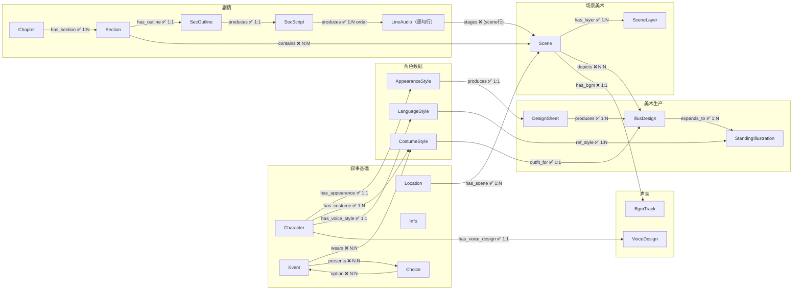

# 代恋 Schema 总览

> Schema 按模块拆分，渐进式披露。每个文件自包含节点定义、边定义、ID 规则。

---

## 全局规则

**边方向原则**：所有边方向统一为 **上游（被继承者/源头）→ 下游（继承者/消费者）**。

**同步机制**：每条边都有 `sync` 属性（boolean）。当上游节点更新时，所有 `sync=true` 的出边指向的下游节点 status 重置为 `-1`（作废重做，skill 必须重新生成覆盖旧产物）。同步沿边方向级联传播。

---

## 模块索引

| 文件 | 内容 | 核心节点 |
|------|------|---------|
| [叙事基础.md](Schema/叙事基础.md) | 角色是谁、做了什么、在哪里、知道什么、在哪选择 | Character, Event, Location, Info, Choice |
| [角色美术.md](Schema/角色美术.md) | 角色如何从文字变成画面 | AppearanceStyle, CostumeStyle, LanguageStyle, DesignSheet, IllusDesign, StandingIllustration |
| [场景美术.md](Schema/场景美术.md) | 场景如何从地点变成画面 | Scene, SceneLayer |
| [剧情.md](Schema/剧情.md) | 剧本章节编排（章→节→场景；结构/提纲/定稿/逐句台词行产物链） | Chapter, Section, SecOutline, SecScript, LineAudio |
| [声音.md](Schema/声音.md) | 角色如何从文字变成声音 + 场景 BGM | VoiceDesign, BgmTrack |

---

## 全节点速查

> 所有节点 ID 使用雪花算法 Base62 编码（如 `Nv93TkkkgC`），全局唯一，无前缀。由 `.claude/scripts/snowflake_base62.py` 生成。
> 引用已有叙事基础节点时，通过名称从数据库查询 ID，不依赖前缀推断。

| 节点 | ID 格式 | 一句话说明 |
|------|---------|-----------|
| Character | snowflake Base62 | 有名字的人物 |
| Event | snowflake Base62 | 某时某刻发生的某件事 |
| Location | snowflake Base62 | 具体地点/游戏场景 |
| Info | snowflake Base62 | 一条有意义的认知碎片 |
| Choice | snowflake Base62 | 玩家选择分叉点（galgame 选项） |
| LanguageStyle | snowflake Base62 | 角色说话方式、语气、口头禅 |
| AppearanceStyle | snowflake Base62 | 角色固定外貌（脸、体型、发色） |
| CostumeStyle | snowflake Base62 | 角色默认着装（衣物、配饰） |
| DesignSheet | snowflake Base62 | 角色三视图设计稿 |
| IllusDesign | snowflake Base62 | 着装适配立绘设计图 |
| StandingIllustration | snowflake Base62 | 具体表情/动作的单张立绘 |
| Scene | snowflake Base62 | 地点内的子场景视觉设定 |
| SceneLayer | snowflake Base62 | 场景的单一图层（背景/地面/陈设/遮罩） |
| Chapter | snowflake Base62 | 剧本章节编排单元（章级：结构 / 分节规划） |
| Section | snowflake Base62 | 章节内的节编排容器（纯编排：节序/标题/概要，无 status 与产物路径） |
| SecOutline | snowflake Base62 | 节级提纲产物（outline_path；0→1 无审批） |
| SecScript | snowflake Base62 | 节级定稿产物（script_path 指 台词.ink；0→1→10→11 定稿审） |
| LineAudio | snowflake Base62 | **逐句台词行**（SecScript-produces{order}-> 1:N；节点 id=行身份；行 status 只代表音频审批 0→10→11，非 say 行拆分即 11；wav 按 voice key 落盘） |
| VoiceDesign | snowflake Base62 | 角色基线音色设计（instruct + 参考音频；多候选流程：3 候选 ref + 3×3 情绪试听 → dashboard 采用固化） |
| BgmTrack | snowflake Base62 | 场景背景音乐（人工生成链；0→1 描述产出→2 用户手动放 wav 归档；无审批） |

---

## 全局边速查

| 边 | 从 → 到 | 基数 | sync | 说明 |
|----|---------|------|------|------|
| **叙事基础** | | | | |
| relation | Character → Character | N:N | ❌ | 人物关系 |
| involved | Character → Event | N:N | ❌ | 人物参与事件 |
| occurred_at | Event → Location | N:1 | ❌ | 事件发生地点 |
| at | Character → Location | N:N | ❌ | 人物—场景 |
| link | Character/Event/Location → Info | N:N | ❌ | 信息关联（仅 3 大实体） |
| evt_relation | Event → Event | N:N | ❌ | 事件因果/时序 |
| presents | Event → Choice | N:N | ❌ | 事件触发选择 |
| option | Choice → Event | N:N | ❌ | 选项导向后续事件 |
| **角色美术** | | | | |
| has_appearance | Character → AppearanceStyle | 1:1 | ✅ | 角色外貌 |
| has_costume | Character → CostumeStyle | 1:N | ✅ | 角色着装 |
| has_voice_style | Character → LanguageStyle | 1:1 | ✅ | 角色语言风格 |
| has_voice_design | Character → VoiceDesign | 1:1 | ✅ | 角色基线音色设计（区别于 has_voice_style 的文字风格） |
| produces | AppearanceStyle → DesignSheet | 1:1 | ✅ | 外貌产出设计图 |
| produces | DesignSheet → IllusDesign | 1:N | ✅ | 设计图→立绘设计图 |
| outfit_for | CostumeStyle → IllusDesign | 1:1 | ✅ | 着装→立绘设计图 |
| wears | Event → CostumeStyle | N:N | ❌ | 事件着装 |
| expands_to | IllusDesign → StandingIllustration | 1:N | ✅ | 拓展表情/动作变体 |
| ref_style | LanguageStyle → StandingIllustration | 1:N | ✅ | 语言风格→立绘参考 |
| **场景美术** | | | | |
| has_scene | Location → Scene | 1:N | ✅ | 地点→场景 |
| has_layer | Scene → SceneLayer | 1:N | ✅ | 场景→图层 |
| **剧情** | | | | |
| has_section | Chapter → Section | 1:N | ✅ | 章→节（组成关系，级联重做） |
| has_outline | Section → SecOutline | 1:1 | ✅ | 节→提纲产物（编排变更级联作废产物链） |
| produces | SecOutline → SecScript | 1:1 | ✅ | 提纲产出定稿（改提纲→定稿/全部行作废） |
| produces | SecScript → LineAudio | 1:N | ✅ | 定稿产出**逐句台词行**（order 大间距排序：初始 ×1000，句间插入取中点；改定稿→全部行作废，重拆按 text_sha1 恢复未变句） |
| contains | Section → Scene | N:M | ❌ | 节编排场景顺序 |
| stages | LineAudio(op=scene) → Scene | N:1 | ❌ | 场景块行→场景实体（块时段投影读 Scene.time_of_day） |
| depicts | Scene → IllusDesign | N:N | ❌ | 场景需要的着装立绘（按需出图门控；变体经 expands_to 跟踪） |
| **声音** | | | | |
| has_voice_design | Character → VoiceDesign | 1:1 | ✅ | 角色基线音色设计 |
| has_bgm | Scene → BgmTrack | 1:1 | ❌ | 场景→背景音乐（BGM 独立资产不级联；scene-design 编排推进） |

---

## 全局结构图

