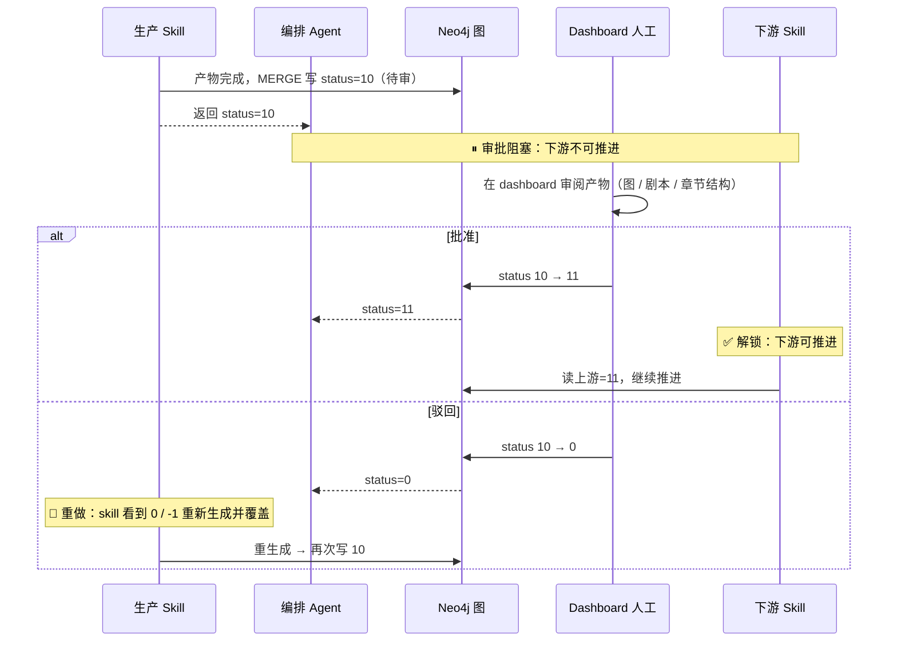
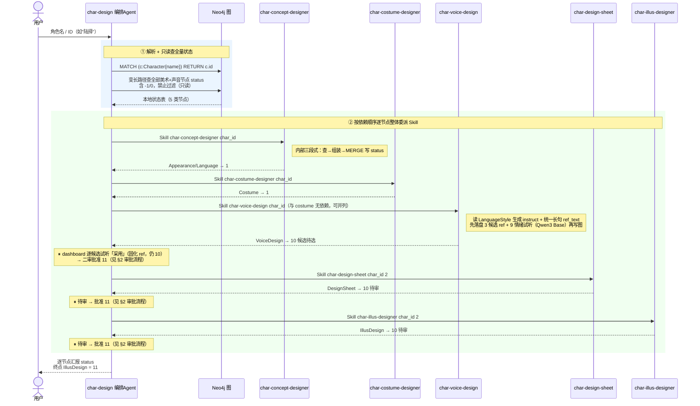
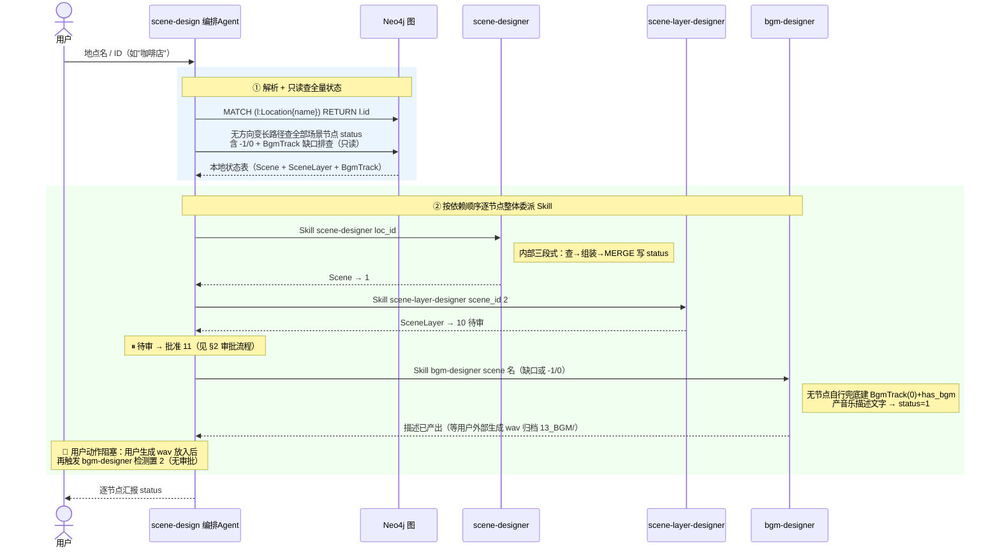
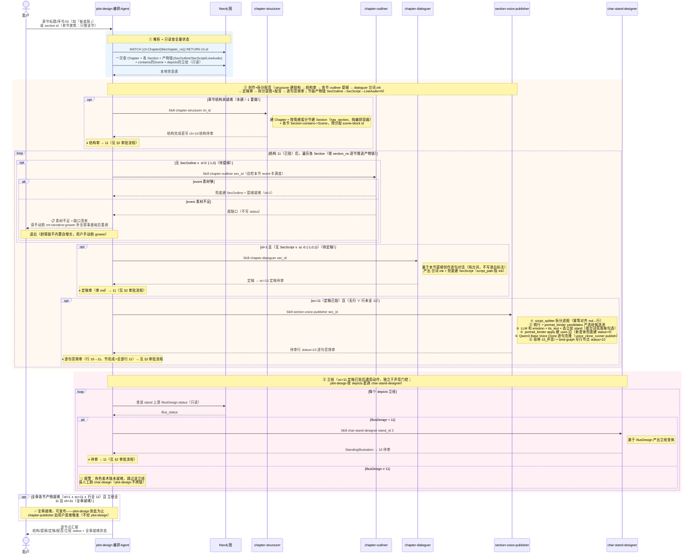

# 代恋 - 三大编排 Agent 流程图

> **本文定位**：可视化 [.claude/agents/](.claude/agents/) 下三个编排层 Agent（`char-design` / `scene-design` / `plot-design`）的执行流程，统一用**时序图**表达。
>
> - **审批流程独立成节**（[§2](#2-审批流程)），不在各 Agent 时序图里展开——时序图只画"生产调度"主线，遇到待审就用 `⏸ 待审 → 批准` 一行带过并引用 §2。

---

## 目录

1. [三个 Agent 的共同铁律](#三个-agent-的共同铁律)
2. [审批流程](#2-审批流程)
3. [char-design —— 角色美术 + 声音生产链](#char-design--角色美术--声音生产链)
4. [scene-design —— 场景美术生产链](#scene-design--场景美术生产链)
5. [plot-design —— 剧情创作生产链](#plot-design--剧情创作生产链)
6. [全部 Skill 功能概述](#全部-skill-功能概述)

---

## 三个 Agent 的共同铁律

> `char-design` / `scene-design` / `plot-design` 是三条生产链各自的**纯编排层**，骨架完全一致，差异只在"调度哪几个 skill / agent"。

| 铁律 | 含义 |
|------|------|
| **纯分发，不亲自动手** | 入口决策只做：解析输入 → 只读查 status → 据 status 决策 → 用 `Skill` 工具加载生产 skill → 复查 → 汇报；**严禁**在入口决策阶段亲自写 Cypher 写入、亲自调生成脚本、绕过生产 skill 直调纯产出子 skill（`*-prompt-assembler` / `infra-image-generator`）。**Skill 工具是扁平的**：加载某生产 skill 后，agent 即在该 skill 流程内继续执行其三段式（含按其指示调用其声明的子 skill），这是预期行为，不是越界；真正越界 = ①未先加载生产 skill 就凭空直调子 skill，或 ②产出文件后不走该 skill「保存结果」步写 status。 |
| **只读查全量，禁止过滤 -1** | 开局一次查询拿到本地状态表。`-1`（作废重做）与 `0`（待生成）都是待办，**禁止**在 WHERE 加 `status >= 0` 把 `-1` 滤掉。 |
| **调度只看 status，不看产物文件** | 唯一判据是节点 `status` 是否到达该链最大门控。**禁止**因 `prompt_path`/`image_path`/`script_path` 已有值或磁盘文件已存在而跳过；`-1` 必须重生成并**覆盖**旧产物，重做时禁止读旧文件。 |
| **全量循环推进，禁止只推一个就停** | 枚举所有 `status < 10` 的待办逐个委派，直到全部到达终态、撞上审批阻塞（`10` 待 dashboard 批）、或撞上需用户决策的分歧点，才返回（plot-design 单节聚焦模式只推目标节，不受此约束）。 |
| **审批阻塞** | 生产节点产物完成即入待审 `10`（Chapter / VoiceDesign / SecScript / LineAudio 由生产 skill 直写，无 submit 步）；批准 `11` 才允许下游推进；驳回归 `0`。审批由 [55_dashboard](55_dashboard/) 人工触发，**详见 [§2 审批流程](#2-审批流程)**。 |
| **复查就地在内存表更新** | 仅在 skill/agent 返回（发生一次写入）后，对**该被推进节点**复查一次；禁止每推一个就重查整张子图。 |
| **汇报逐节点交代** | 列出全部节点，逐个给 `status` + 本轮是否处理；未推进的说明原因；**禁止**把 `status=-1` 误报成"节点未创建"。 |

### status 语义（三链通用）

```
-1  作废重做（sync 级联重置后；看到 -1 必须重生成覆盖，禁止跳过）
 0  待处理 / 待生成
 1  已完成（数据节点）｜提示词完成（生产节点）
 2  图片完成（生产节点可选中间态）
10  待审（审批专属，等 dashboard）
11  批准（生产节点唯一"真正完成"值）
```

> 审批态与生产态数值隔开：生产用 `0/1/2`，审批专属 `10`/`11`。数据节点完成值 `1`（无审批）；生产节点完成值 `11`。**全图统一，无 label 专属值**（原 Section 专属值 20-33 已随 Section 拆分为产物链而废除）。

---

## 2. 审批流程

> 所有**生产节点**（产出图片/剧本/章节结构的节点）完成后都要人工审批。审批态用 `10`（待审）/ `11`（批准），与生产态 `0/1/2` 隔开。本节是通用流程，各 Agent 时序图遇到待审均引用此处。



### 待审节点清单

| 节点 | 进入待审 | 批准解锁的下游 |
|------|---------|-----------------|
| DesignSheet | 图片完成 → 10 | IllusDesign |
| IllusDesign | 图片完成 → 10 | StandingIllustration（plot-design 按 depicts 推进） |
| StandingIllustration | 图片完成 → 10 | 无下游；作为发布前置（质量确认） |
| SceneLayer | 图片完成 → 10 | 无下游；作为发布前置 |
| VoiceDesign | 候选+试听落盘即写 `10`（无 submit 步；`candidates_path` 非空=候选待选，dashboard 试听「采用」固化 ref 后仍 10 走二审） | `11` → 节级配音（section-voice-publisher 要求 VoiceDesign=11） |
| Chapter | 结构完成 → `10`（structurer 直写，不经 submit） | `11` → 进入节级生产（提纲 / 定稿 / 拆分配音） |
| SecScript（定稿审） | 定稿完成 → `10`（dialoguer 直写，不经 submit；审批对象为 **台词.ink** 全文） | `11` → 节级拆分+配音 + 该节立绘推进 |
| LineAudio（逐句音频审） | 配音完成 → 行节点 `10`（section-voice-publisher 的 bind-graph 直写，不经 submit；**行级** status 只代表音频审批） | 全部行 `11` = 该节配音完成（派生判断，无节级批准按钮；全章各节产物就绪 + 立绘全 11 才发布） |

> AppearanceStyle / LanguageStyle / CostumeStyle / Scene / SecOutline 等数据节点完成值 `1`，**无审批**。
> 产物链各节点独立审批——驳回 SecScript 只重写定稿（SecOutline 不动）、驳回单句 LineAudio 行只重配该句（SecScript 不动）；上游变更的作废走 sync 级联（见 §5）。SecScript 支持**人工微调回路**：直接编辑 台词.ink 改单句 → dashboard「重新提交审批」0/1/11→10（**仅改 sc status、不动行节点**；不经 dialoguer，手改不丢——重批后重拆按 text_sha1 保留未变句审批结果，只重配被改句）。

---

## char-design —— 角色美术 + 声音生产链

> **职责**：对角色进行基础设计，包括外貌特征、语言风格、声音、着装。

### 节点 → Skill 映射

| 图节点 | Skill | Status 流程 | 审批 |
|--------|-------|------------|------|
| AppearanceStyle / LanguageStyle | char-concept-designer | -1/0 → 1 | 无 |
| CostumeStyle | char-costume-designer | -1/0 → 1 | 无 |
| VoiceDesign | char-voice-design | -1/0→1→10→11 | ✅ |
| DesignSheet | char-design-sheet | -1/0→1→2→10→11 | ✅ |
| IllusDesign | char-illus-designer | -1/0→1→2→10→11 | ✅ |

### 时序图



> **Skill 工具是扁平的**：char-design 用 `Skill` 加载 `char-design-sheet` / `char-illus-designer` 后，即在该 skill 流程内继续执行其三段式，**包括按其指示调用子 skill**（`char-prompt-assembler` 组装提示词 → `infra-image-generator` 出图）——这是预期行为，不是越界；status 由该 skill 的「保存结果」步统一写入（判定标准见 §1 铁律）。

---

## scene-design —— 场景美术 + BGM 生产链

> **职责**：对场景进行基础设计，包括整体氛围设计、背景图、BGM（BgmTrack 人工生成链：skill 产描述 → 用户外部工具生成 wav 归档）。

### 节点 → Skill 映射

| 图节点 | Skill | Status 流程 | 审批 |
|--------|-------|------------|------|
| Scene | scene-designer | -1/0 → 1 | 无 |
| SceneLayer | scene-layer-designer | -1/0→1→2→10→11 | ✅ |
| BgmTrack | bgm-designer（缺口兜底自建） | -1/0→1（描述产出）→2（用户放 wav 后检测） | 无 |

### 时序图



---

## plot-design —— 剧情创作生产链

> **唯一职责**：推进某章节从「建结构 → 创作（提纲 + 细节对话）→ 拆分+配音 → 立绘」到全章就绪为止。输入**章节标题、序号或 ID**（如「新皮肤」、`1`、snowflake ID），或**小节 section id**（单节聚焦，由 dashboard「推进此节」入口触发，只推该节的提纲/定稿/配音/该节关联立绘）。
>
> 创作链（混合粒度）= **章级结构段 → 结构审（渲染设计简报）→ 各节提纲段 → 各节定稿段（台词.ink）→ 各节定稿审 → 各节拆分+选绘+配音段 → 各节逐句音频审 → 立绘（按需）**，到全章就绪为止；BGM 走 scene-design 编排（`bgm-designer`），plot-design 不查不调 BgmTrack。结构段是**章级**，产物链是**节级**（各节独立推进、独立审批、独立重做）；**发布不在 plot-design 职责内**——全章就绪后汇报退出，`chapter-publisher` 由用户直接触发：
> 1. 创作侧拆为 `chapter-structurer`（建结构+设计简报）→ `chapter-outliner`（提纲）→ `chapter-dialoguer`（台词.ink）→ `section-voice-publisher`（拆分进图 + 选绘建边 + 配音），原 `screenwriter` 已删除；BGM 走 `bgm-designer`（scene-design 编排：产描述文字 → 用户手动生成 wav 归档 `13_BGM/`）。
> 2. **节级产物链**（Section 拆分后）：`Section -has_outline-> SecOutline -produces-> SecScript -[:produces {order}]-> LineAudio(×N 逐句行)`，链式 sync 级联——改提纲自动作废定稿+全部行、改定稿自动作废全部行；三产物独立审批，驳回互不牵连（驳回 SecScript 只重写定稿、驳回单句行只重配该句）。「节完成」= SecOutline=1 ∧ SecScript=11 ∧ 该节全部行 LineAudio=11。
> 3. **台词双轨分离**：`台词.ink`（人读/人改的唯一定稿格式，ink 方言机器可解析）↔ 图行（结构化真相：行身份=节点雪花 id，顺序=produces 边 order 大间距 ×1000 中点插入）。审批通过（sc=11）后由 section-voice-publisher 第一步拆分进图（script_splitter.py 幂等对齐：新增建行+中点 order、修改沿用节点置 0、删除 DETACH DELETE、级联未变句恢复）再配音。`台词.jsonl` 已停产（历史文件留创作区，链路不再读取）。
> 4. 立绘侧：**StandingIllustration 由 plot-design 直接调 `char-stand-designer <stand_id>`**（按需；SecScript=11 定稿已批后通用动作，独立于声音门控——立绘不依赖配音）；上游 `IllusDesign` 未就绪时**报警跳过**（不跨链调 `char-design`，角色美术链由人工单独跑）。
> 5. 素材门控：**outliner 自检 event 不够丰满时拒绝产出提纲并报告缺口**，plot-design 汇报后退出（剧情链不内置自增长）——用户手动跑 `nrt-narrative-grower`（可选聚焦入参 + 多轮迭代）补全叙事基础后重调 plot-design。

### 创作侧四阶段（对应 4 个 skill）

| 阶段 | Skill | 状态 | 职责 |
|------|-------|------|------|
| ① 建章节结构 | `chapter-structurer` | ✅ 已实现 | 建 Chapter + 按情感弧分节建 Section（has_section，纯编排容器无 status）+ 各节 `Section-contains->Scene`，预分配全章 scene-block id |
| ② 出节级提纲 | `chapter-outliner` | ✅ 已实现 | 为**每节**产出提纲（入参 section_id，落盘 `25_剧本/chapter<NN>_<章概述>/sec<MM>_<节概述>/outline.md`；兜底建 SecOutline 节点 → ol=1） |
| ③ 节级细节对话 | `chapter-dialoguer` | ✅ 已实现 | **纯台词创作**：基于**本节**提纲创作逐句对话，产出 `25_剧本/.../sec<MM>_/台词.ink`（人读 ink 方言、机器可解析：场景块标记带 scene_block_id、说话行 `角色名:台词`、选择/分支/结局标记——**不写演出标注**，立绘由配音期选绘判定；入参 section_id；兜底建 SecScript 节点 script_path 指 ink → sc=10 定稿待审，dashboard 审 ink） |
| ④ 节级拆分+选绘+配音 | `section-voice-publisher` | ✅ 已实现 | 定稿已批（SecScript=11）后**拆分进图**（script_splitter.py 对齐 md↔已有行 → 逐句 LineAudio + produces{order}）→ 挑行（say 且 status∈{0,-1}）+ 产选绘候选池（portrait_binder candidates）+ **LLM 判 emotion + 产 tts_text 变体 + 选立绘 stand**（按台词氛围每句选，池中无贴切变体则提新变体）→ **apply 建边**（`LineAudio-[:uses {sync:false}]->stand` 每句一条 + 新变体兜底建 status=0 + depicts/expands_to）+ Qwen3 Base Voice Clone 逐句克隆 → 母带 `15_声音/<chapter_stem>/<scene_block_id>/` + bind-graph 写行节点（待审行 status=10，dashboard 按节聚合逐句通过=11/驳回=0，试听读母带）。不拷运行时副本——`99_game/assets/` 只由发布期按 status=11 收录（立绘整键沿 uses 边投影） |

> **门控**：① 建章节结构 → 结构审通过（ch=11）→ 才进入 ②③④ 节级创作；SecScript=11（定稿已批）才拆分配音、才推该节立绘（立绘独立于音频门控）；**全章就绪 = ch=11 ∧ 各节产物就绪（ol=1 ∧ sc=11 ∧ 行全 11）∧ 立绘全 `11`**——plot-design 到此汇报退出，发布由用户直接触发 `chapter-publisher`。
> **status**：Chapter 章级结构段 `0→1→10→11`（结构审，completion=11）；节级产物链 **SecOutline `0→1`（无审批）· SecScript `0→1→10→11`（定稿审，10 由 dialoguer 直写）· LineAudio 逐句行（say 行 `0→10→11` 行级音频审，10 由 bind-graph 直写；非 say 行拆分即 11）**；BgmTrack `0→1→2`（无审批，2=音频已归档）——全图统一通用值，Section 本身无 status。
> **推进粒度**：dashboard 章行「推进剧情创作」= 章节全量（structurer / 全量循环，到全章就绪即止，不发布）；各节「推进此节」（`ch.status==11` 且该节产物链未全就绪且无待审项时出现）= 单节聚焦（plot-design 按产物链当前段推进该节；SecScript=11 时拆分配音后推该节关联立绘；不碰其他节、不发布）。

### 节点 → Skill 映射

| 图节点 | Skill | Status 流程 | 审批 |
|--------|-------|------------|------|
| Chapter | `chapter-structurer` | -1/0→1→10→11 | ✅ |
| Section | `chapter-structurer`（创建） | 无 status | — |
| SecOutline | `chapter-outliner` | -1/0→1 | 无 |
| SecScript | `chapter-dialoguer` | -1/0→1→10→11（script_path 指 台词.ink） | ✅（审 ink） |
| LineAudio（逐句行 ×N） | `section-voice-publisher`（拆分进图 + 配音） | say 行：-1/0→10→11；非 say 行拆分即 11 | ✅（逐句审） |
| StandingIllustration | `char-stand-designer`（直调 stand_id） | -1/0→1→2→10→11 | ✅ |
| BgmTrack | `bgm-designer`（**scene-design 编排**，plot-design 不查不调） | -1/0→1→2 | 无（手工放入文件夹即合格） |

> `chapter-publisher`（章级发布，不写节点 status）**不在此表**——由用户直接触发，不在 plot-design 职责内。

### 时序图



---

## 全部 Skill 功能概述

> 下表覆盖三条生产链的全部 skill + 叙事层 + 基础设施。**纯产出层**（只产文件、不读写图、不写 status）单独标注。三个**编排 Agent**（`char-design` / `scene-design` / `plot-design`）不在此表——它们是调度者，调度的对象就是表里的 skill。

### 叙事层（创作输入 → 叙事图）

| Skill | 功能 | 主要产出 | 读写图 / 写 status |
|-------|------|---------|-------------------|
| nrt-narrative-extractor | 从创作文本提取结构化实体 + 6 种关系 | CSV + import.cypher（离线文件） | ❌ 不直连（人工触发导入） |
| nrt-graph-builder | 手动 / discover 发现模式增量建图 | 直接写入 Neo4j | ✅ |
| nrt-narrative-grower | 叙事图体检 + 修改建议（可选聚焦 + 多轮迭代，限定基础节点） | `02_剧情数据/<日期>_round<N>_建议.json` | ✅（dashboard 审批写回） |

### 角色美术 + 声音层（Character → IllusDesign / VoiceDesign）

| Skill | 阶段 | 功能 | 主要产出 | 读写图 / 写 status |
|-------|------|------|---------|-------------------|
| char-concept-designer | ① 概念 | 外貌 + 语言风格设计 | AppearanceStyle / LanguageStyle 字段 | ✅ |
| char-costume-designer | ② 着装 | 着装设计 | CostumeStyle 字段 | ✅ |
| char-voice-design | ② 声音设计（与着装并列） | 角色基线音色多候选设计（instruct ≤60 字 + 统一长句 ref_text → 3 候选 ref + 每候选 3 情绪试听，dashboard 试听「采用」固化） | `14_声音设计/<char>/candidates/` + `<char>_ref.wav` | ✅ |
| bgm-designer | 场景 BGM（scene-design 编排，亦可用户直触） | 缺口自行兜底建 BgmTrack + 生成音乐描述文字给用户 → 用户外部工具手动产 wav 归档 `13_BGM/<name>.wav` → 检测置 2（Scene-has_bgm->BgmTrack 1:1） | BgmTrack prompt/description + wav | ✅ |
| char-design-sheet | ③ 三视图 | 外貌底图设计（文生图） | DesignSheet prompt + 图 | ✅ |
| char-illus-designer | ④ 立绘设计图 | 着装适配立绘（图生图） | IllusDesign prompt + 图 | ✅ |
| char-stand-designer | ⑤ 立绘变体 | 表情/动作变体（图生图），stand_id 按需模式（变体需求由 section-voice-publisher 配音判断期选绘兜底建缺口，description 含变体氛围） | StandingIllustration prompt + 图 | ✅（plot-design 直调） |
| char-prompt-assembler | 纯产出 | 组装角色提示词（Mode A/B/C） | prompt 文件 | ❌ |

### 场景美术层（Location → SceneLayer）

| Skill | 阶段 | 功能 | 主要产出 | 读写图 / 写 status |
|-------|------|------|---------|-------------------|
| scene-designer | ① 场景 | 场景设计 | Scene 字段 | ✅ |
| scene-layer-designer | ② 图层 | 场景图层（文生图/图生图） | SceneLayer prompt + 图 | ✅ |
| scene-prompt-assembler | 纯产出 | 组装场景提示词 | prompt 文件 | ❌ |

### 剧情层（Chapter + Section 产物链 → 运行时）

| Skill | 阶段 | 功能 | 主要产出 | 读写图 / 写 status |
|-------|------|------|---------|-------------------|
| chapter-structurer | ① 章级结构 | 建 Chapter + 按情感弧分节建 Section（纯编排容器）+ 各节 `Section-contains->Scene` + 预分配 scene-block id | Chapter + has_section + Section + contains 边 | ✅ |
| chapter-outliner | ② 节级提纲 | 为**每节**出提纲（入参 section_id；兜底建 SecOutline 节点 → ol=1） | `25_剧本/chapter<NN>_<概述>/sec<MM>_<概述>/outline.md` | ✅ |
| chapter-dialoguer | ③ 节级定稿 | **纯台词创作**：基于**本节**提纲创作逐句对话，产出人读 ink 方言定稿（场景块标记带 scene_block_id、说话行 `角色名:台词`、选择/分支/结局标记——不写演出标注，立绘由配音期选绘判定；入参 section_id；兜底建 SecScript 节点 script_path 指 ink → sc=10） | `25_剧本/.../sec<MM>_/台词.ink` | ✅ |
| section-voice-publisher | ④ 节级拆分+选绘+配音 | 定稿已批（SecScript=11）：script_splitter 拆分对齐进图（逐句 LineAudio + produces{order} 中点排序）→ 挑行 + portrait_binder candidates 候选池 → LLM 判 emotion + 产 tts_text 变体 + 选立绘 stand → apply 建 `LineAudio-[:uses]->stand` 边（新变体兜底建 status=0 + depicts/expands_to）→ Qwen3 Base Voice Clone 逐句克隆 → bind-graph 写行节点 status=10（母带即产物，运行时副本不在此步） | 图逐句行 + uses 选绘边 + 立绘缺口 + `15_声音/<chapter_stem>/<scene_block_id>/<key>.wav` 母带 | ✅ |
| chapter-publisher | 章级发布（用户直接触发，不经 plot-design） | 全章各节产物就绪（各节 SecOutline=1 ∧ SecScript=11 ∧ 行全 11）时**从图投影**合并 + 立绘/背景/BGM/已批音频（voices+sfx，voice_bundler publish 按 status=11）到运行时 + 补 manifest.voices / chapter_packs | `99_game/` 资源 + manifest | ✅ |

### 基础设施 & 元工具

| 组件 | 功能 | 说明 |
|------|------|------|
| infra-image-generator | 读 prompt 调 OfoxAI API 出图（纯产出） | 文生图 / 图生图；不写图、不写 status |
| cypher_exec.py | 执行 Cypher（统一图读写入口） | 所有 skill 读写 Neo4j 的唯一脚本，支持 `-c`/`-f`/`--stdin`/`--multi`/`--json` |
| `.claude/skills/section-voice-publisher/scripts/` | 声音链脚本组（收编进 skill） | script_splitter.py（台词.ink 拆分对齐进图：parse_ink + difflib 对齐 + 单事务写图）· voice_clone_runner.py（Qwen3 全家：候选/试听/ref + 逐句配音 publish，env/.venv-qwen）· voice_bundler.py（voice key 单一源 make_voice_key + tasks-from-graph/bind-graph + publish 发布期拷运行时）· paths.py（模型路径配置，读 settings.json）；char-voice-design / chapter-publisher 跨 skill 引用 |

> 纯产出层（`char-prompt-assembler` / `scene-prompt-assembler` / `infra-image-generator`）只产文件，节点字段与 status 一律由调用方生产 skill 在「保存结果」步用 MERGE 兜底写入。

---

## 项目文件夹结构

> 目录前缀的数字是**流水线阶段编号**（创作输入 `00_` → 叙事数据 `01_` → 剧情数据 `02_` → 美术 `06_/07_` → 声音 `14_/15_` → 剧本 `25_` → 后台 `55_` → 成品 `99_`），按编号即可判断某产物在链路中的位置。`.claude/` 是 Claude Code 自动化层（skill / agent / 脚本），`env/` 是声音链隔离环境（gitignore）。

```
代恋/
├── .claude/                          # Claude Code 自动化层
│   ├── agents/                       # 编排 agent：char-design / scene-design / plot-design
│   ├── scripts/                      # cypher_exec.py · snowflake_base62.py · voice/（Qwen3 声音链脚本）
│   └── skills/                       # 全部生产 skill（见 §6 全部 Skill 功能概述）
│
├── 00_init/                          # 创作输入 + Schema（唯一事实来源）
│   ├── Schema/                       # Neo4j Schema（叙事基础 / 角色美术 / 场景美术 / 剧情 / 声音）
│   └── migration/
│
├── 01_叙事数据/                      # nrt-narrative-extractor 离线产出
│   └── csv/                          # 实体/关系 CSV + import.cypher
│
├── 02_剧情数据/                      # nrt-narrative-grower 建议 JSON（<日期>_round<N>_建议.json + _reviewed.json 审批留痕）
│
├── 06_角色美术/                      # 角色美术产出（DesignSheet / IllusDesign / StandingIllustration）
│   ├── 沈暮雪/
│   │   ├── 沈暮雪-电竞经理职业装/    # 每套着装 = 一个 IllusDesign，含 prompt.md + 立绘设计图.png；其下 立绘/ 子目录 = StandingIllustration 立绘变体（<变体>.png + <变体>.md 同名配对）
│   │   └── …                         # 同角色其余着装（咖啡店休闲装 / 西餐厅约会装 / 路边摊日常 …）
│   ├── 陆择/
│   └── …                             # 其余角色（林梦 / 苏晓禾 / 陈默 / 顾盈 …）
│
├── 07_场景美术/                      # 场景美术产出（Scene / SceneLayer）
│   └── 酒店/
│       └── 酒店-客房/
│           └── background/           # 各图层背景图
│
├── 14_声音设计/                      # char-voice-design 产出（<char>/candidates/ 多候选 ref + 情绪试听；采用后固化 <char>_ref.wav）
│
├── 15_声音/                          # TTS 逐句母带（<char>/<char>-<stem>-<scene_block_id>-<行节点id>.wav；requirements/ venv 锁文件，见其 README）
│
├── 25_剧本/                          # 剧本产出（章+节两层：structurer 出设计简报；outliner/dialoguer 按节产出）
│   └── chapter<NN>_<章概述>/         # 每章一目录：设计简报.md + 各 sec<MM>_<节概述>/（outline.md + 台词.ink）
│
├── 55_dashboard/                     # 人工治理后台（Streamlit，http://localhost:8501）
│   ├── config/                       # settings.py（凭证来源）
│   ├── core/                         # schema_loader · status · cascade · graph_repo
│   ├── repo/                         # 后台层 Cypher 读写封装（cypher_exec.py 的等价物）
│   ├── tests/                        # core 层单测（纯单测，不连真实 Neo4j）
│   └── ui/                           # 页面 + components/
│
├── env/                              # 声音链环境（gitignore）：.venv-qwen（Qwen3-TTS）
│
└── 99_game/                          # Godot 4.3+ 游戏运行时（chapter-publisher 发布目标）
    ├── assets/                       # portraits / scenes / bgm / voices / sfx（发布期按 status=11 收录的运行时副本）
    ├── data/chapters/                # 发布后的章节剧本 JSON（ScriptInterpreter 消费）
    ├── scenes/                       # Godot 场景
    ├── scripts/                      # autoload / data / scenes / ui / util
    ├── tools/                        # validate_chapter.py（数据校验，无需 Godot）
    └── tests/
```
